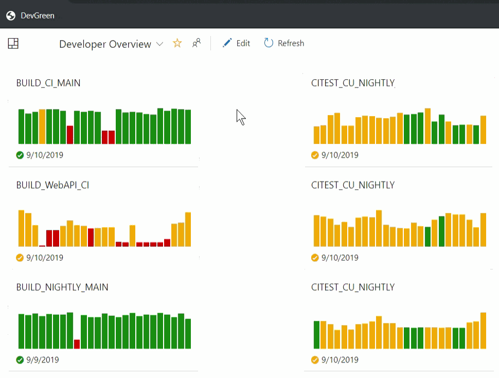

# DevGreen

*DevGreen* is a browser [bookmarklet](https://en.wikipedia.org/wiki/Bookmarklet) that brings your [Azure DevOps](https://azure.microsoft.com/en-us/services/devops/) dashboards into a proudly presentable state - 100% green.

    

It's a must-have tool for all DevOps engineers who still do not know:

- how to throw [the powerful anti-meeting spell](https://dilbert.com/strip/2007-09-09) when asked for the build status in a meeting
- how to face their [Pointy-haired Boss](https://en.wikipedia.org/wiki/Pointy-haired_Boss) when he asks for the same thing